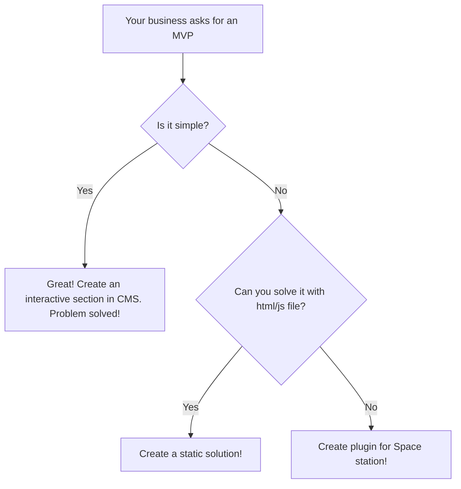

# Space station

CMS for enterprise portals.

# Goals

Big enterprises need enterprise software. Today’s market is dominated by bloated ERPs, colossal BI solutions, and massive data centers. But not all applications need to be overwhelmingly complex; large companies often need simple tools too. The problem arises when managing hundreds of these disparate solutions. 

Our portal aggregates common functionality across different systems, separating mature applications from small, experimental ones. It unifies shared access, centralizes common functions, and streamlines data flow. 

Think of it as a space station designed to dock starships of any type.

## Run

Run in developer debug mode

    litestar run --reload --debug

Run in production mode

	litestar run --reload 

or

	uvicorn app:app --port 8000 --host 127.0.0.1

# To do

- [x] auth
- [x] Base CMS
- [ ] Interactive CMS
- [ ] Common tickets and forum
- [x] Global db
- [ ] Global ref books
- [ ] Local db's
- [x] Pods for internal solutions
- [x] Pods for static solutions
- [ ] Subscribe solution for ref book broadcasting
- [ ] Central analitics

