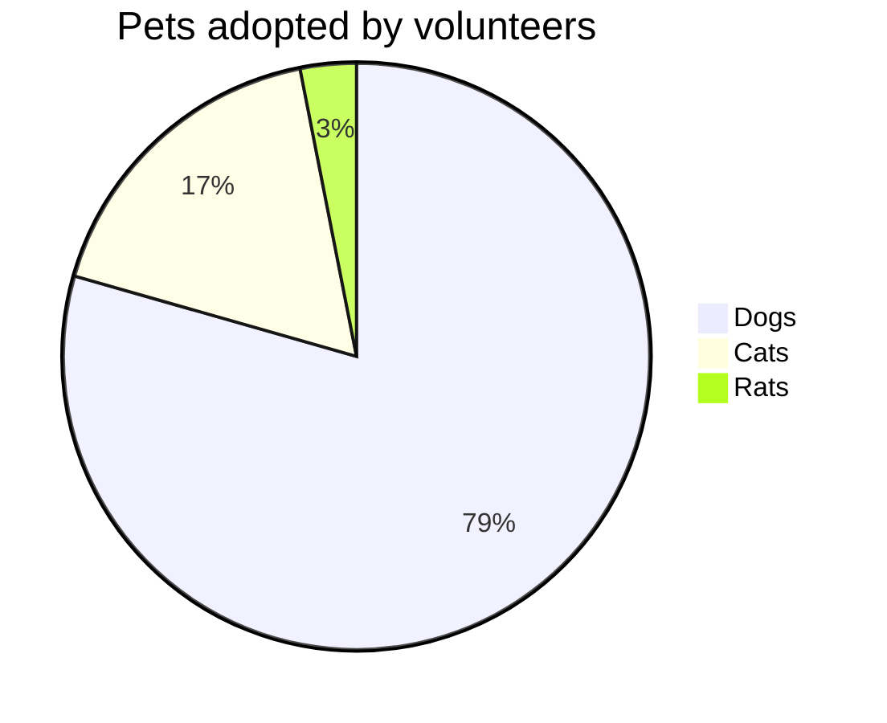
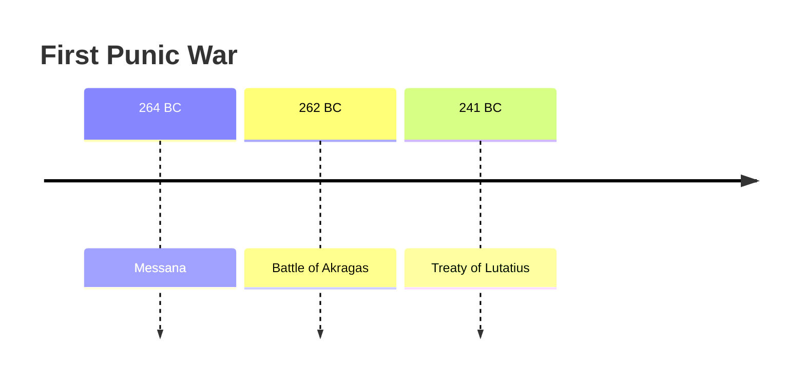

# Help

CMS contain list of pages. Each page contain title (plain text) and list of sections.

Each section is a markdown text, with Mermaid diagram support.

## Markdown tags
```
# Heading 1
## Heading 2
### Heading 3
#### Heading 4
##### Heading 5
###### Heading 6

Text Formatting

Bold: Wrap text in two asterisks **text** or two underscores __text__.
Italic: Wrap text in one asterisk *text* or one underscore _text_.
Strikethrough: Wrap text in two tildes ~~text~~.
Combined: Wrap text in three asterisks ***text*** for bold and italic.
Line Break: Add two spaces at the end of a line and hit Enter.

- Item 1
- Item 2
  - Sub-item (Indent with 2 or 4 spaces)

1. First item
2. Second item
3. Third item

Insert hyperlink
[Space station](https://github.com/postpdm/space_station/)

> This is a blockquote.
> It can span multiple lines.

Horizontal Rules
Insert three or more asterisks ***, hyphens ---, or underscores ___ on a line by themselves to create a divider.

Tables
| Left Aligned | Center Aligned | Right Aligned |
| :---         |     :---:      |          ---: |
| Text         | More Text      | $100          |

```

You can read more about [Markdown](https://en.wikipedia.org/wiki/Markdown).

## Mermaid


[Mermaid](https://mermaid.js.org/ecosystem/tutorials.html) is a markdown extention to code diagram's with test description. Combine it with markdown text.

### Flowcharts
	```mermaid
	flowchart LR
		Start --> Stop
	```

Result


### Pie
	```mermaid
	pie title Pets adopted by volunteers
		"Dogs" : 386
		"Cats" : 85
		"Rats" : 15
	```

Result



### Timelines

	```mermaid
	timeline
		title First Punic War
		264 BC : Messana
		262 BC : Battle of Akragas
		241	BC : Treaty of Lutatius
	```

Result

