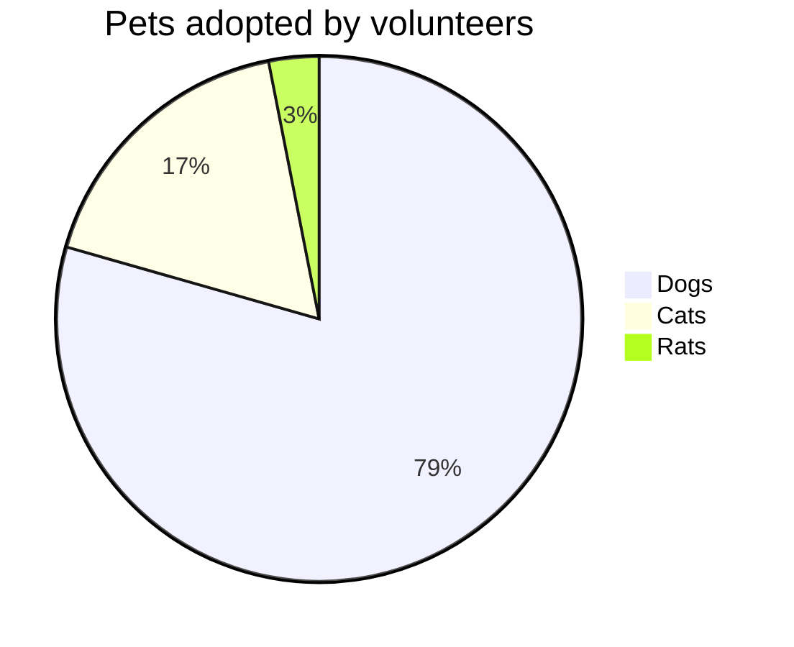
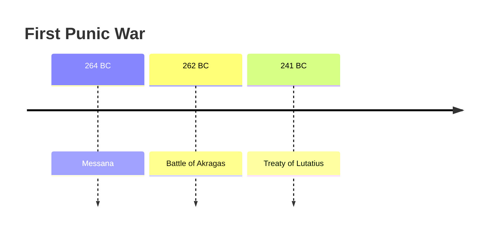

# Help

**Orion** Content Management System (CMS) contain list of pages, grouped to Page Tree. Each page contain title (plain text) and list of sections.

Each section is a markdown text, with Mermaid diagram support and Orion manuscript.

## Markdown tags
```
# Heading 1
## Heading 2
### Heading 3
#### Heading 4
##### Heading 5
###### Heading 6

Text Formatting

Bold: Wrap text in two asterisks **text** or two underscores __text__.
Italic: Wrap text in one asterisk *text* or one underscore _text_.
Strikethrough: Wrap text in two tildes ~~text~~.
Combined: Wrap text in three asterisks ***text*** for bold and italic.
Line Break: Add two spaces at the end of a line and hit Enter.

- Item 1
- Item 2
  - Sub-item (Indent with 2 or 4 spaces)

1. First item
2. Second item
3. Third item

Insert hyperlink
[Space station](https://github.com/postpdm/space_station/)

> This is a blockquote.
> It can span multiple lines.

Horizontal Rules
Insert three or more asterisks ***, hyphens ---, or underscores ___ on a line by themselves to create a divider.

Tables
| Left Aligned | Center Aligned | Right Aligned |
| :---         |     :---:      |          ---: |
| Text         | More Text      | $100          |

```

You can read more about [Markdown](https://en.wikipedia.org/wiki/Markdown).

This is a **client-side rendering** component.

## Mermaid


[Mermaid](https://mermaid.js.org/ecosystem/tutorials.html) is a markdown extention to code diagram's with test description. Combine it with markdown text.

### Flowcharts
	```mermaid
	flowchart LR
		Start --> Stop
	```

Result


### Pie
	```mermaid
	pie title Pets adopted by volunteers
		"Dogs" : 386
		"Cats" : 85
		"Rats" : 15
	```

Result



### Timelines

	```mermaid
	timeline
		title First Punic War
		264 BC : Messana
		262 BC : Battle of Akragas
		241	BC : Treaty of Lutatius
	```

Result



This is a **client-side rendering** component.

## Orion manuscript

Orion manuscript is a internal scripting language.

This is a **server-side rendering** component.

Line started with `:` mean command to execute. Next lines after `:` command is arguments for command.

Code can contain comments, text after `#` chatacter was ignored.

### SQL
`: sql` mean SQL expression to fetch data from DB. Arguments is a SQL script.

<pre>
``` orion_manuscript

: sql # prepare SQL
select count(id) as a, date(created_at) as d from cms_page group by date(created_at)

```
</pre>

`: sql` is a command to treat next line (lines) as SQL select code to execute. Only `select` is allowed.
`select count(id) as a, date(created_at) as d from cms_page group by date(created_at)` is a SQL script (could be multiline). Case insensitive.


<pre>
``` orion_manuscript
: sql # prepare SQL
# multiline query code
SELECT count(id) AS a, 
date(created_at) AS d 
FROM cms_page GROUP BY date(created_at)
```
</pre>

### Show table
`: show table` line mean insert the HTML table with previous `sql` results. No arguments required. Of course in previous block you should execute the SQL to fetch data to show.

<pre>
``` orion_manuscript

: sql # prepare SQL
select count(id) as a, date(created_at) as d from cms_page group by date(created_at)

: show table # execute SQL and show results as html table
```
</pre>


### Show mermaid
`: show mermeid` mean insert the Mermaid-formated chart from previous `sql` results. You can compose the mermaid body with Jinja template language (also supported).


<pre>
``` orion_manuscript

: sql # prepare SQL
select count(id) as a, date(created_at) as d from cms_page group by date(created_at)

: show mermaid # execute SQL and show results as mermaid graph
# mermaid code compose with Jinja template tags
    pie title Pie chart

    "{{i.d}}" : {{i.a}}


```
</pre>

You can't insert mermaid opening and closing tags, becouse you alrady in `orion_manuscript` block. So you don't. CMS add whis tags by itself. Don't be missunderstud with separated mermaid block.
Write a chart type (`pie`), title (`title`) and data for loop with plain text and Jinja commands.

You can use any [Jinja](https://jinja.palletsprojects.com/en/stable/templates/) options, except `import` and `include` (becouse CMS render template from memory and have no option to load it from disk).


You can use any Mermaid chart's types.

<pre>
``` orion_manuscript

: sql

SELECT count(id) AS a, date(created_at) AS d FROM cms_page GROUP BY date(created_at)

: show mermaid
timeline
	title Pages as timeline

    {{i.0}} : {{i.1}}

```
</pre>

**Important**! Dataset fetched from SQL command live only in one section! You should generate table and graph in a same section as a SQL.

#### Accessing dataset in Jinja template

In mermaid code `dataset` variable always contain a sql results (if exists).

`i` is just a loop row variable, you can use any name.

Values an accessible by index:
<pre>

    {{i.0}} : {{i.1}}

</pre>

or by SQL field name:

<pre>

    {{i.d}} : {{i.a}}

</pre>
